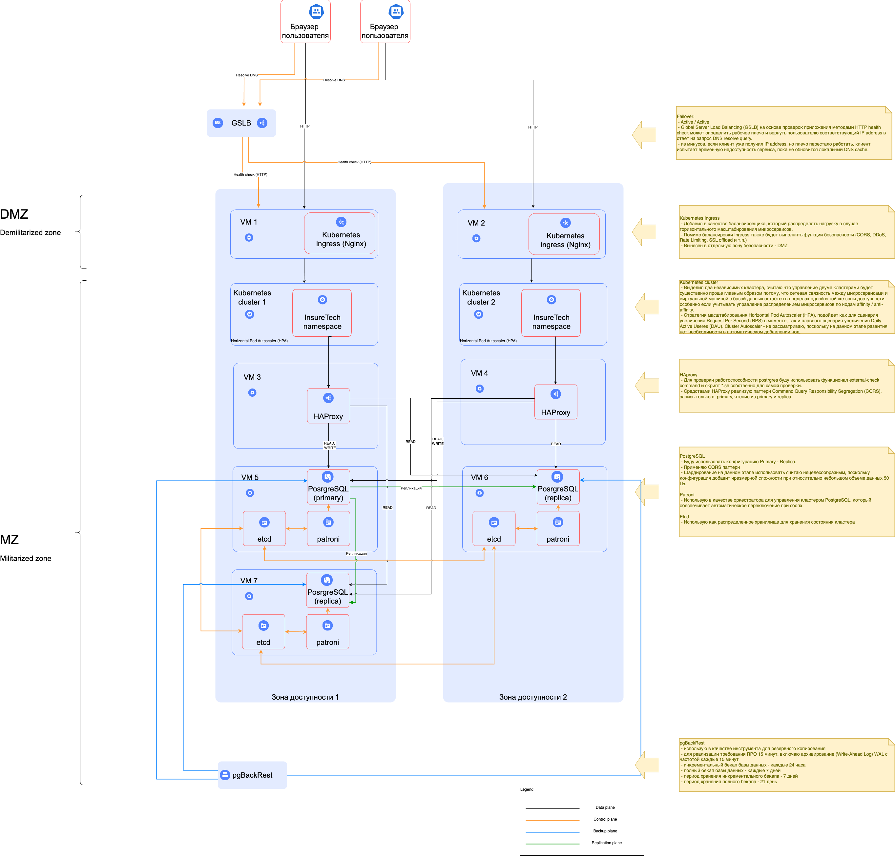

# Задание 1. Проектирование технологической архитектуры

## Схема исходник

[drawio](./InsureTech_технологическая_архитектура_to-be.drawio)

## Cхема

## Описание

### Failover

 - Active / Acitve
 - Global Server Load Balancing (GSLB) на основе проверок приложения методами HTTP health check может определить рабочее плечо и вернуть пользователю соответствующий IP address в ответ на запрос DNS resolve query.
 - из минусов, если клиент уже получил IP address, но плечо перестало работать, клиент испытает временную недоступность сервиса, пока не обновится локальный DNS cache.

### Kubernetes Ingress

 - Добавил в качестве балансировщика, который распределять нагрузку в случае горизонтального масштабирования микросервисов.
 - Помимо балансировки Ingress также будет выполнять функции безопасности (CORS, DDoS, Rate Limiting, SSL offload и т.п.)
 - Вынесен в отдельную зону безопасности - DMZ. 

### Kubernetes cluster

 - Выделил два независимых кластера, считаю что управление двумя кластерами будет существенно проще главным образом потому, что сетевая связность между микросервисами и виртуальной машиной с базой данных остаётся в пределах одной и той же зоны доступности особенно если учитывать управление распределением микросервисов по нодам affinity / anti-affinity.
 - Стратегия масштабирования Horizontal Pod Autoscaler (HPA), подойдет как для сценария увеличения Request Per Second (RPS) в моменте, так и плавного сценария увеличения Daily Active Useres (DAU). Cluster Autoscaler - не рассматриваю, поскольку на данном этапе развития нет необходимости в автоматическом добавлении нод.

### HAproxy

 - Для проверки работоспособности postrgres буду использовать функционал external-check command и скрипт *.sh собственно для самой проверки.
 - Средствами HAProxy реализую паттерн Command Query Responsibility Segregation (CQRS), запись только в  primary, чтение из primary и replica  

### PostgreSQL cluster

#### PostgreSQL

 - Буду использовать конфигурацию Primary - Replica.
 - Применяю CQRS паттерн
 - Шардирование на данном этапе использовать считаю нецелесообразным, поскольку конфигурация добавит чрезмерной сложности при относительно небольшом объеме данных 50 ГБ.

#### Patroni

 - Использую в качестве оркестратора для управления кластером PostgreSQL, который обеспечивает автоматическое переключение при сбоях.

#### Etcd

 - Использую как распределенное хранилище для хранения состояния кластера 

### pgBackRest

 - использую в качестве инструмента для резервного копирования
 - для реализации требования RPO 15 минут, включаю архивирование (Write-Ahead Log) WAL с частотой каждые 15 минут
 - инкрементальный бекап базы данных - каждые 24 часа
 - полный бекап базы данных - каждые 7 дней
 - период хранения инкрементального бекапа - 7 дней
 - период хранения полного бекапа - 21 день
