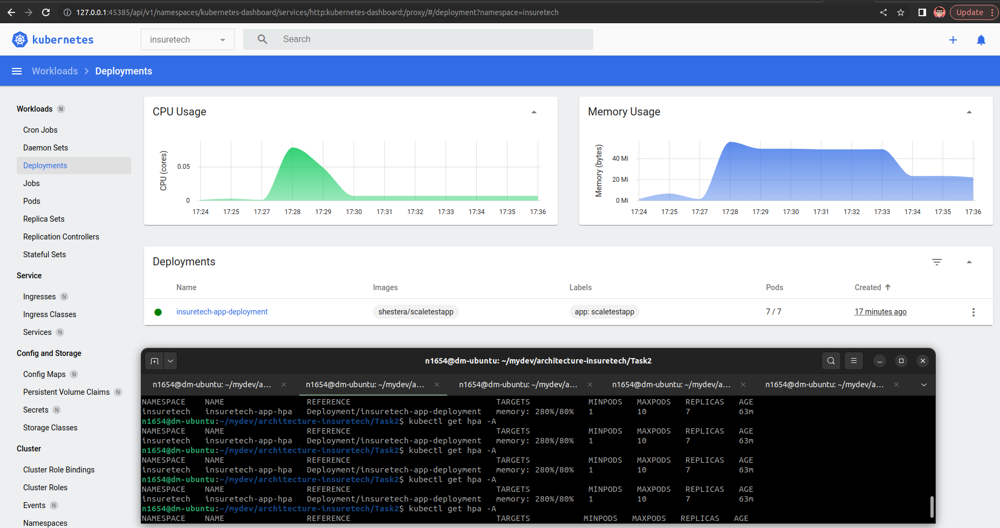
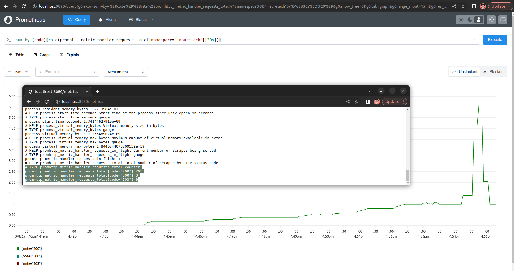
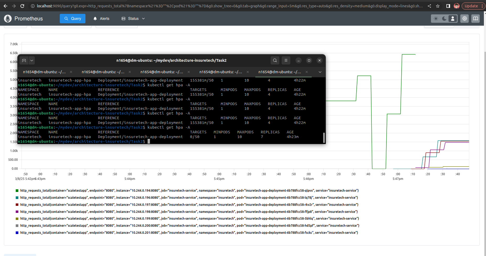

# Задание 2. Динамическое масштабирование контейнеров

 - ✅ Обязательная часть
 - ✅ Дополнительная часть
___

 - [Манифест развёртывания (Deployment)](./deployment.yaml)
 - [Доработанный манифест для Horizontal Pod Autoscaler](./HorizontalPodAutoscaler.yaml)
 - [Манифест для Service](./service.yaml)
 - [Манифест для ServiceMonitor](./ServiceMonitor.yaml)

 - [Скриншоты дашборда или логи, которые показывают, что количество реплик базы данных поменялось в ответ на сгенерированную нагрузку](./img/k8s_dashboard.png) 
 - [Скриншоты Prometheus, отображающие сбор нужных метрик приложения](./img/prometheus.png)
 - [Скриншоты дашборда или логи, которые показывают, что количество реплик базы данных поменялось в ответ на сгенерированную нагрузку](./img/load_test_2.png)

## Описание

#### ✅ Обязательная часть задания

##### Конфигцурация и запуск приложения

```sh
kubectl apply -f ./namespace.yaml
kubectl apply -f ./deployment.yaml
kubectl apply -f ./service.yaml
kubectl port-forward svc/insuretech-service -n insuretech 8080:8080
minikube start --addons=metrics-server
minikube addons enable metrics-server
minikube dashboard

kubectl get hpa -A
kubectl get deployment metrics-server -n kube-system
```

##### Установка и запуск генератора нагрузки locust

```sh
python3 -m venv ./loadgen-venv
source ./loadgen-venv/bin/activate
pip3 install locust
locust
```

Для конфигурации locust ипользовать `host`, полученный через команду

```sh
minikube service insuretech-service -n insuretech --url
```

##### Результаты

Конфигурация для нагрузки 

| Attribute | Value |
| --- | --- |
| Number of users | 10000 |
| Host | http://192.168.49.2:31841 |
| Ramp up | 100 | 
| Run time | 60s |  

##### K8s dashboard



##### События HorizontalPodAutoscaler 

```sh
kubectl get events -n insuretech | grep -i HorizontalPodAutoscaler
33m         Warning   FailedGetResourceMetric        horizontalpodautoscaler/insuretech-app-hpa        failed to get memory utilization: unable to get metrics for resource memory: no metrics returned from resource metrics API
38m         Warning   FailedComputeMetricsReplicas   horizontalpodautoscaler/insuretech-app-hpa        invalid metrics (1 invalid out of 1), first error is: failed to get memory resource metric value: failed to get memory utilization: unable to get metrics for resource memory: no metrics returned from resource metrics API
46m         Normal    SuccessfulRescale              horizontalpodautoscaler/insuretech-app-hpa        New size: 2; reason: memory resource utilization (percentage of request) above target
32m         Normal    SuccessfulRescale              horizontalpodautoscaler/insuretech-app-hpa        New size: 2; reason:
31m         Normal    SuccessfulRescale              horizontalpodautoscaler/insuretech-app-hpa        New size: 4; reason: memory resource utilization (percentage of request) above target
31m         Normal    SuccessfulRescale              horizontalpodautoscaler/insuretech-app-hpa        New size: 7; reason: memory resource utilization (percentage of request) above target
20m         Normal    SuccessfulRescale              horizontalpodautoscaler/insuretech-app-hpa        New size: 3; reason: All metrics below target
15m         Normal    SuccessfulRescale              horizontalpodautoscaler/insuretech-app-hpa        New size: 2; reason: All metrics below target
```


##### Логи locust

```sh
[2025-03-08 17:26:51,734] dm-ubuntu/INFO/locust.runners: Ramping to 10000 users at a rate of 100.00 per second
[2025-03-08 17:27:15,785] dm-ubuntu/WARNING/root: CPU usage above 90%! This may constrain your throughput and may even give inconsistent response time measurements! See https://docs.locust.io/en/stable/running-distributed.html for how to distribute the load over multiple CPU cores or machines
...

[2025-03-08 17:27:49,469] dm-ubuntu/WARNING/locust.runners: CPU usage was too high at some point during the test! See https://docs.locust.io/en/stable/running-distributed.html for how to distribute the load over multiple CPU cores or machines
```


#### ✅ Дополнительная часть задания

##### Конфигурация

```sh
helm repo add prometheus-community https://prometheus-community.github.io/helm-charts
helm repo update
helm install prometheus-operator prometheus-community/kube-prometheus-stack
kubectl apply -f ./ServiceMonitor.yaml
kubectl apply -f ./HorizontalPodAutoscaler.yaml
helm install prometheus-adapter prometheus-community/prometheus-adapter -n prometheus -f values.yaml

```

##### Метрики

Запрос для проверки

```promql
sum by (code)(rate(promhttp_metric_handler_requests_total{namespace="insuretech"}[30s]))
```



##### HPA Под нагрузкой



##### Логи

```sh
112s        Normal    SuccessfulRescale              horizontalpodautoscaler/insuretech-app-hpa        New size: 4; reason: pods metric http_requests_per_second above target
14m         Normal    SuccessfulRescale              horizontalpodautoscaler/insuretech-app-hpa        New size: 5; reason: pods metric http_requests_per_second above target
2m7s        Normal    SuccessfulRescale              horizontalpodautoscaler/insuretech-app-hpa        New size: 2; reason: pods metric http_requests_per_second above target
97s         Normal    SuccessfulRescale              horizontalpodautoscaler/insuretech-app-hpa        New size: 7; reason: pods metric http_requests_per_second above target
```