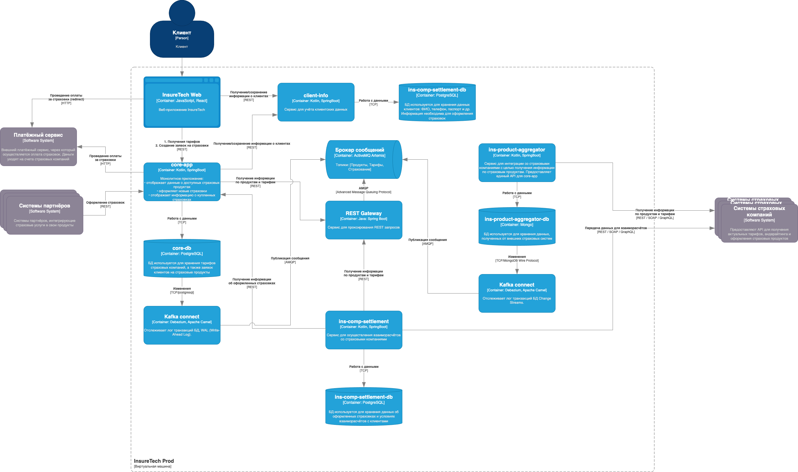

# Задание 3. Переход на Event-Driven архитектуру

## Проблемы и риски

Очевидная проблема, если на этапе подключения к пяти внешним сервисам уже есть ошибки и задержки, то при подключении новых пяти сервисов старые ошибки останутся, а новые могут кратно увеличится.

Ошибки в первую очередь связаны с ожиданием самого медленного внешнего сервиса:
 - Время отклика будет равняться времени отклика самого медленного сервиса-источника.

Вторая проблема - это данные, которые возможно будут не нужны или избыточны, а это отразится на запросах от B2B клиентов, так как будут зависеть от этих данных, даже если они не нужны:
 - Низкая надёжность из-за зависимости всех процессов от всех сервисов `Системы партнеров -> core-app -> ins-product-aggregator -> 10 x Системы страховых компаний`, даже если их данные не нужны в этом процессе.
 - Передача избыточного объёма данных, которая возлагает дополнительную нагрузку на сеть и увеличивает время передачи данных. Это и необходимость обрабатывать лишние данные, замедляет время отображения страниц для пользователей.

Третья проблема - это избыточная синхронная связность между сервисами, которая может привести к отсутствию консистенции данных между сервисами, и самое главное может стать серьёзным препятствием при горизонтальном масштабировании:
 - как core-app, так и ins-comp-settlement обращаются к ins-product-aggregator, который в свою очередь выполняет сравнительно дорогую (по времени) операцию -> логично обращаться непосредственно к данным (1) и только в том случае если они действительно были изменены (2)
 - ins-comp-settlement дополнительно обращается к core-app, то есть получается топология "треугольник" или "каждый с каждым" -> при условии динамического масштабирования логичнее использовать централизованную топологию "звезда".

## Схема исходник

[InsureTech_C4_container-diagram.drawio](./InsureTech_C4_container-diagram.drawio)

## Схема

